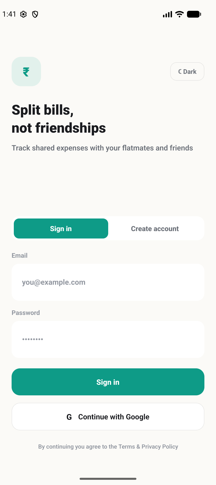
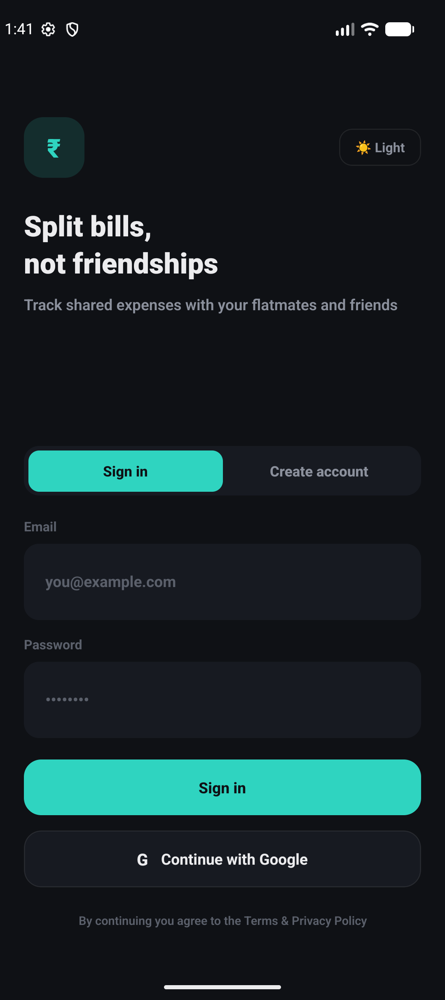
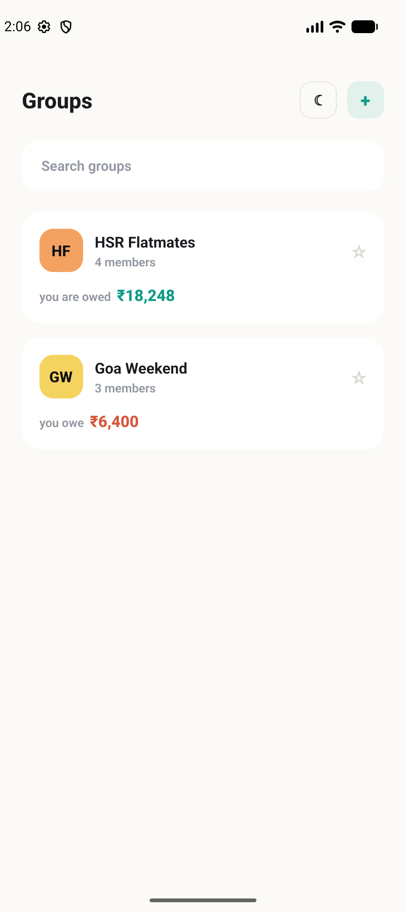
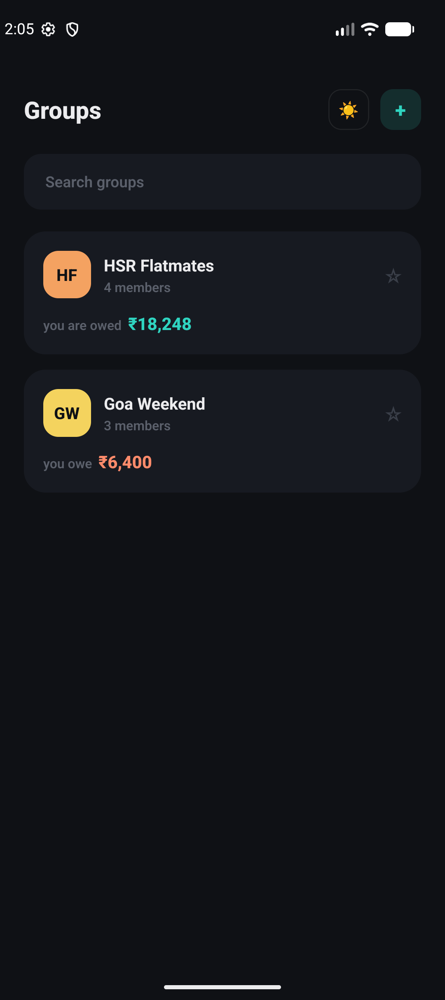
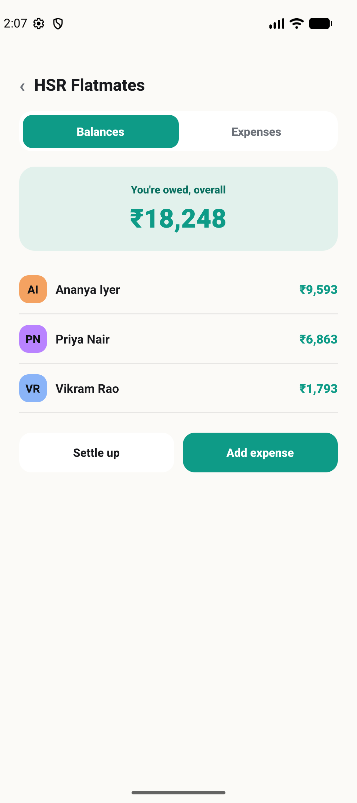
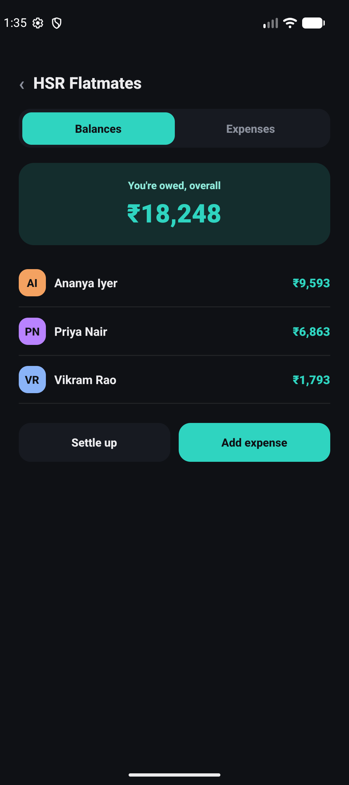
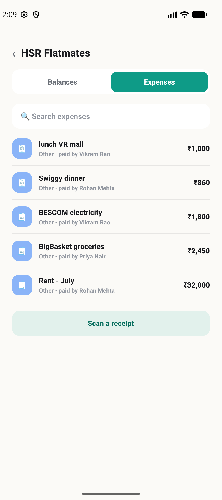
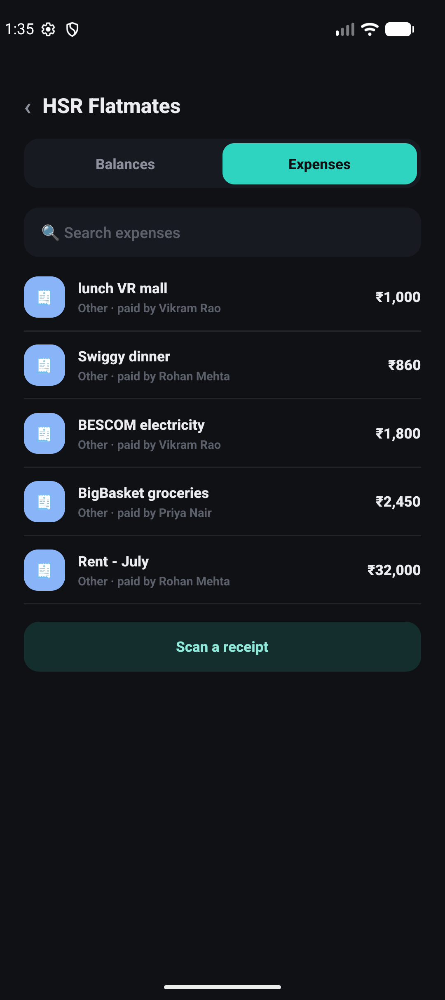
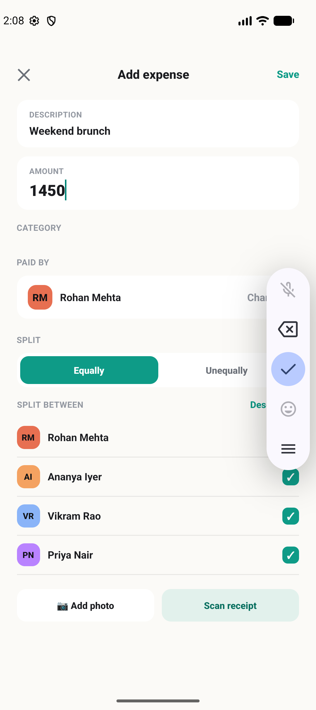
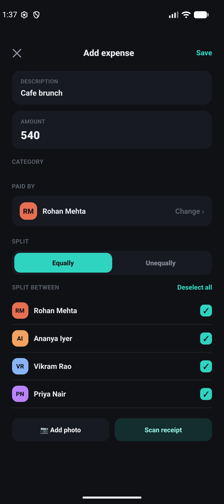

<div align="center">

# 💸 Splitkaro

**Split bills, not friendships.**

A React Native app for tracking shared expenses with flatmates and friends —
who paid, who owes what, and who to pay back — with a real backend, full
light/dark theming, and a clean, mockup-accurate UI.


</div>

---

## ✨ See it in action

<table>
<tr>
<th>Light</th>
<th>Dark</th>
</tr>
<tr>
<td></td>
<td></td>
</tr>
<tr>
<td></td>
<td></td>
</tr>
<tr>
<td></td>
<td></td>
</tr>
<tr>
<td></td>
<td></td>
</tr>
<tr>
<td></td>
<td></td>
</tr>
</table>

*A real group's expense history — rent, groceries, electricity, dinners — all split and settled automatically.*

---

## 🧾 About

Splitkaro is a **Splitwise-style expense splitter**, built as a React Native
client on top of a real backend that exposes **both REST and GraphQL**. Sign
in, create a group, add an expense, split it equally or unevenly, and see
exactly who owes whom — with one-tap suggestions for settling up.

The whole app runs on a ~90-line hand-rolled JS navigator (no `react-navigation`
needed), keeps a single design language across every screen, and looks equally
sharp in light or dark mode.

## 🚀 Features

- **🔐 Real authentication** — email/password sign-up and sign-in against a
  live REST API (JWT access + refresh tokens); Google sign-in slot ready for
  native SDK wiring.
- **👥 Groups** — create groups, invite flatmates by email, favorite the ones
  you check most, see a live member count and net balance per group.
- **🧮 Expenses** — add expenses with a category, payer, and split — **equally**
  across everyone or **unevenly** with exact custom amounts per person.
- **⚖️ Balances, done for you** — per-group and overall balances computed
  server-side via GraphQL, with ready-made "who pays whom" settle-up
  suggestions instead of manual math.
- **🤝 Settle up** — record a payment against any outstanding balance in one
  tap.
- **🔎 Search** — instantly filter a group's expense history.
- **🌗 Light & dark themes** — a hand-tuned palette for both, toggled from the
  header on any screen.
- **🧵 GraphQL + REST, used where each shines** — REST for the auth token
  lifecycle, GraphQL for everything data-shaped (`me`, `myGroups`,
  `groupExpenses`, `groupBalances`, `groupSettleSuggestions`, and the
  mutations behind every write).

## 🛠 Tech stack

| | |
|---|---|
| **Framework** | React Native 0.86 (New Architecture + Hermes) |
| **Language** | TypeScript |
| **Navigation** | Custom lightweight JS stack navigator |
| **Data** | REST (`/api/auth/*`, `/api/users/*`) + GraphQL (`/graphql`) |
| **State** | React Context (`AuthContext`, `ThemeContext`) — no external state library |
| **Testing** | Jest + `react-test-renderer` |
| **Linting** | ESLint (`@react-native/eslint-config`) |

## 📁 Project structure

```
App.tsx                 # entry point: providers + navigator wiring
src/
  api/
    client.ts            # REST + GraphQL fetch clients
    endpoints.ts          # typed API calls, grouped by domain
    types.ts              # shared domain types
  auth/                  # auth context (access/refresh token + user)
  theme/                 # light/dark palettes + ThemeProvider
  nav/                   # tiny JS-only stack navigator
  components/            # shared UI primitives (Screen, Avatar, buttons, …)
  screens/               # one file per screen
  util/                  # formatters (rupees, dates, initials), useApi hook
docs/screenshots/        # README screenshots
```

### Screens

Login (sign in / create account) → Groups → Group detail (Balances /
Expenses tabs) → Create group · Add expense (+ paid-by picker) · Split
unevenly · Expense detail · Settle up · Search · Profile.

## ⚙️ Getting started

### Prerequisites

- Node.js ≥ 22.11
- A running Splitkaro backend exposing REST auth on `/api/auth/*` and
  GraphQL on `/graphql`, on port `4000`

### API host per platform

`src/api/client.ts` targets the host machine automatically:

- **iOS simulator** → `http://localhost:4000`
- **Android emulator** → `http://10.0.2.2:4000`

Running on a **physical device**? Set `API_HOST` in `src/api/client.ts` to
your computer's LAN IP (e.g. `192.168.1.x`) and make sure the device is on
the same network.

### Install & run

```bash
npm install      # first time only

npm start         # Metro bundler (terminal 1)

npm run ios       # or: npm run android   (terminal 2)
```

## 🗺 Roadmap

- Native Google Sign-In (the button's wired up, just needs the SDK)
- Receipt OCR scanning (no backend endpoint yet — UI is ready and waiting)
- Two-way settle-up (currently you can record paying someone; being paid
  back has to be recorded from their account)
